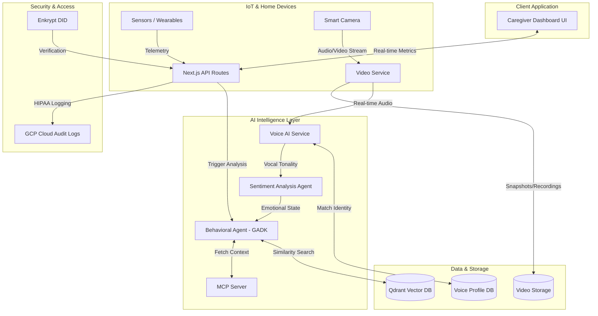

# Architecture - AuraCare

AuraCare leverages a modern, serverless Google Tech Stack combined with AI Agent frameworks to provide proactive caregiver support.

## High-Level Architecture Diagram
*(Mermaid Diagram)*

## Component Breakdown

1.  **Client Application (Next.js):** The frontend caregiver dashboard built with React, Tailwind CSS, and Next.js App Router.
2.  **Multimodal AI (Voice & Sentiment):** The `Voice AI Service` processes audio from Smart Cameras against a `Voice Profile DB`. The `Sentiment Analysis Agent` extracts emotional distress or confusion, feeding this context to the main behavioral agent.
3.  **Security Layer (Enkrypt):** Decentralized Identity (DID) validation via Enkrypt ensures that only authorized medical staff and caregivers can access the system.
4.  **Context Standardization (MCP):** The Model Context Protocol (MCP) server securely formats patient history (age, recent notes) so the AI agent has the full picture before analyzing data.
5.  **AI Orchestration (GADK + Mastra):** The Google Agent Development Kit handles the core reasoning (anomaly detection), while Mastra orchestrates the workflow and triggers emergency protocols.
6.  **Vector Store (Qdrant):** Stores high-dimensional embeddings of a patient's historical behavior. The agent queries Qdrant to understand if current sensor data deviates from the patient's unique baseline.
7.  **Infrastructure (GCP Cloud Run):** Containerized deployment ensuring rapid scalability and HIPAA-eligible serverless execution.
