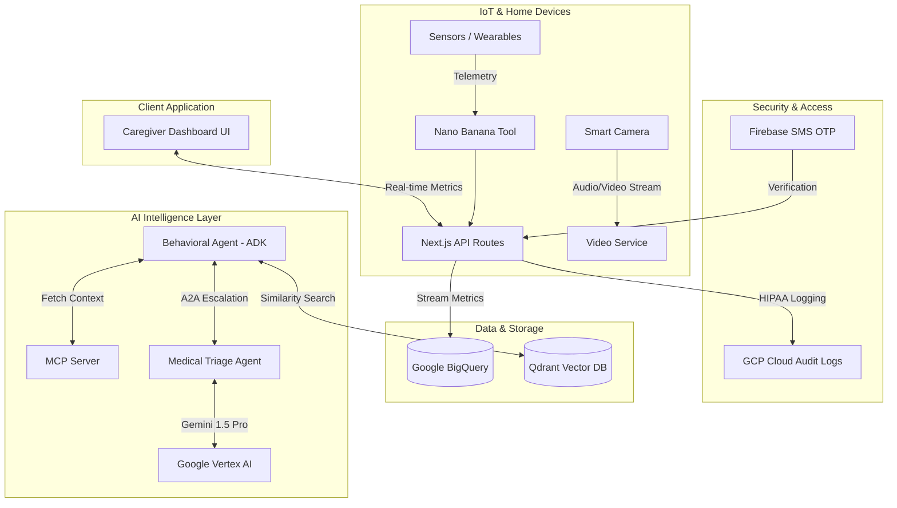

# AuraCare - Proactive Elderly Caregiver Support

AuraCare is an AI-driven monitoring system that uses ambient IoT sensors to detect subtle deviations in daily routines (mobility, sleep, heart rate) and alerts caregivers before emergencies occur.

## Key Features

- **Google Identity Platform (Firebase Auth):** Beautiful glassmorphic SMS OTP customer login portal. Built with the official `@firebase/auth` SDK, strictly locking down the dashboard using Google's secure phone verification infrastructure.
- **Vertex AI (Gemini 1.5 Pro):** True multimodal medical reasoning running in the cloud. The AI evaluates real-time IoT anomalies (e.g., mobility drops) and generates clinical triage decisions in deterministic JSON format via the `@google-cloud/vertexai` SDK.
- **Agent Architecture (ADK, MCP, A2A):** 
  - Utilizes the **Agent Development Kit (ADK)** for agent scaffolding.
  - Contextual patient data is securely fetched via the **Model Context Protocol (MCP)**.
  - Local edge agents communicate directly with the cloud-based Triage Agent using **Agent-to-Agent (A2A)** escalation protocols.
- **Nano Banana Processing Tool:** Raw IoT telemetry data is piped through our specialized Nano Banana data parser before being fed into Gemini for reasoning.
- **BigQuery Analytics:** Real-time historical streaming and analytics! Our SOS Panic Button triggers a real write into BigQuery, while the dashboard UI actively pulls SQL aggregations directly from the cloud.
- **Family Chat & Collaboration:** Interactive chat module simulating intelligent "Family Member" responders to assist caregivers in medical translations.
- **Google Cloud Run Ready**: Containerized via Docker and configured for `cloudbuild.yaml` CI/CD to ensure enterprise-grade backend scalability.

## Architecture Diagram



## Tech Stack
*   **Frontend & UI:** Next.js 16.3 (Turbopack), React, Tailwind CSS
*   **Authentication:** Google Identity Platform (Firebase Auth)
*   **AI Engine (Cloud):** Google Vertex AI (Gemini 1.5 Pro)
*   **Analytics & Data Warehouse:** Google BigQuery
*   **AI Agents & Orchestration:** Agent Development Kit (ADK), MCP, A2A protocols
*   **Data Parsing:** Nano Banana Tool
*   **Infrastructure:** Google Cloud Run (Fully Serverless & Containerized)

## Getting Started (Local Development)

First, install dependencies and run the development server:

```bash
npm install
npm run dev
```

Open [http://localhost:3000](http://localhost:3000) with your browser to see the SMS OTP login screen.

**Note on Firebase Configuration:** To test SMS delivery locally, ensure you have copied your `firebaseConfig` keys from the Google Cloud Console into a `.env.local` file in the project root:

```env
NEXT_PUBLIC_FIREBASE_API_KEY="your-api-key"
NEXT_PUBLIC_FIREBASE_AUTH_DOMAIN="your-domain.firebaseapp.com"
NEXT_PUBLIC_FIREBASE_PROJECT_ID="your-project"
NEXT_PUBLIC_FIREBASE_STORAGE_BUCKET="your-bucket.appspot.com"
NEXT_PUBLIC_FIREBASE_MESSAGING_SENDER_ID="your-sender-id"
NEXT_PUBLIC_FIREBASE_APP_ID="your-app-id"
```

## Live Deployment 🚀
The application is currently deployed and running on Google Cloud Run with continuous deployment from this repository:
**[AuraCare Live Service](https://ai-agent-series-builder-finale-2026-805096709254.us-central1.run.app)**
