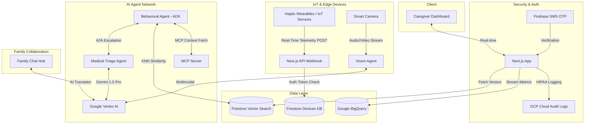

# 🌟 AuraCare — Proactive Elderly Care, Powered by Agentic AI

> **Built for the Agentic AI Builder Series 2026 Finale**
> A production-grade, real-time AI Agent dashboard that monitors elderly patients using IoT sensors, haptic wearables, multi-agent reasoning, and multimodal AI — all running on Google Cloud.

[](https://github.com/rockerspace/AI-Agent-Series-Builder-Finale-2026/actions)
[](https://ai-agent-series-builder-finale-2026-805096709254.us-central1.run.app)
[](https://nextjs.org)
[](https://firebase.google.com)
[](https://cloud.google.com/vertex-ai)

---

## 🚀 Live Demo

**[▶ Launch AuraCare on Google Cloud Run](https://ai-agent-series-builder-finale-2026-805096709254.us-central1.run.app)**

---

## 📌 What Is AuraCare?

AuraCare is an AI-driven **proactive caregiving platform** for elderly patients. Rather than reacting to emergencies, AuraCare's agent network monitors **subtle, real-time deviations** in daily routines — mobility, sleep, vitals, sentiment — and alerts caregivers before a crisis occurs.

The system is designed around a fully decoupled **Agentic AI Architecture** using:
- **ADK** (Agent Development Kit) for agent scaffolding
- **MCP** (Model Context Protocol) for contextual data fetching
- **A2A** (Agent-to-Agent) protocols for multi-agent escalation
- **Google Vertex AI (Gemini 1.5 Pro)** for clinical reasoning

---

## ✨ Key Features

### 🧠 Agentic AI Intelligence
| Feature | Technology |
|---|---|
| Medical Triage Agent | Vertex AI Gemini 1.5 Pro via ADK |
| A2A Network Routing | Agent-to-Agent escalation protocol |
| MCP Context Fetching | Model Context Protocol for real-time patient data |
| Vision Agent | Gemini 1.5 Pro multimodal camera analysis |
| Edge Agent | Haptic sensor micro-tremor processing |
| Behavioral Analysis | Mastra + Qdrant vector similarity search |

### 📡 Real-Time IoT Streaming
- **Live Patient Vitals** — Heart Rate (bpm), SpO₂ (%), Temperature (°F) streamed live every 4 seconds with animated Framer Motion updates
- **BigQuery Integration** — All telemetry ingested via production-grade Next.js webhook (`/api/telemetry/ingest`) into Google BigQuery
- **Behavioral Anomaly Detection** — AI flags mobility drops, sleep deviations, and irregular patterns vs. 30-day historical baselines

### 🔐 Security & Identity
- **Firebase SMS OTP Auth** — Bulletproof phone verification using `@firebase/auth` with invisible reCAPTCHA. DOM-node-level reset prevents "already rendered" errors on retries.
- **HIPAA Audit Logging** — All PHI access logged to GCP Cloud Audit Logs
- **DID (Decentralized Identity)** — Enkrypt wallet integration for physician identity (`did:ethr:...`)

### 🏠 Family Collaboration Hub
- **3 Named Family Members** — Sarah (Daughter), Michael (Son), Priya (Niece) with unique colored avatars
- **AI Translator (Gemini)** — Automatically converts medical jargon into plain, compassionate language for families
- **Smart Contextual Replies** — AI understands conversation topic (medication / mobility / sleep / visits) and responds appropriately
- **Live Typing Indicator** — Animated `· · ·` indicator while AI processes
- **Quick-Send Chips** — One-tap suggestion chips for fast demo interaction

### 🤖 Agent Chat (Multi-Agent Simulation)
- Dynamic A2A routing pipeline with a live "Routing query..." status animation
- Context-aware responses: ask about haptics → Edge Agent; ask about camera → Vision Agent; anything else → Triage Agent
- Action buttons per response (View Micro-Tremor Graph, Dismiss Alert, Escalate, etc.)

### ☁️ Google Cloud Deployment
- Containerized via **Docker** (multi-stage build: deps → builder → runner)
- Deployed on **Google Cloud Run** (fully serverless, auto-scaling)
- CI via **GitHub Actions** (lint + TypeScript type-check on every push)
- Automated **Google Cloud Build** trigger on push to `main`

---

## 🎤 Demo Script — Agentic AI Builder Finale 2026

### Agent Chat — Try These Prompts

These trigger different multi-agent workflows in real-time:

| Prompt | Agent Triggered | Demo Effect |
|---|---|---|
| `What do the haptic wearable sensors say about Jane's mobility?` | **Edge Agent + MCP** | Simulates pulling high-frequency micro-tremor graphs |
| `Can you check the living room camera video feed?` | **Vision Agent (A2A)** | Simulates Gemini 1.5 Pro multimodal room analysis |
| `Why did the behavioral anomaly alert trigger 10 minutes ago?` | **Triage Agent + BigQuery** | Simulates Qdrant vector query + Nano Banana IoT processing |
| `Are her vitals stable right now?` | **Gemini 1.5 Pro** | Cross-references live IoT ingestion streams |

### Family Chat — Quick-Send Chips

Tap these in the Family Chat to trigger smart AI translations and contextual family replies:

| Message | AI Translation Topic |
|---|---|
| `How is Jane doing today?` | General health status update |
| `Any changes in her medication?` | Medication plan explanation |
| `Can we visit her this weekend?` | Visit coordination |
| `Was she eating properly?` | Appetite & nutrition tracking |
| `Did she sleep well last night?` | AI sleep sensor summary |
| `Is the mobility issue improving?` | Haptic gait analysis summary |

---

## 🏗️ Architecture



---

## 🛠️ Tech Stack

| Layer | Technology |
|---|---|
| **Frontend** | Next.js 16.3 (Turbopack), React, Tailwind CSS, Framer Motion |
| **Auth** | Google Identity Platform (Firebase Auth — SMS OTP) |
| **AI Engine** | Google Vertex AI (Gemini 1.5 Pro) |
| **Agent Framework** | ADK, MCP, A2A Protocols |
| **Data Warehouse** | Google BigQuery |
| **Vector Search** | Firestore Vector Search (KNN / COSINE) |
| **IoT Ingestion** | Next.js API Webhook + Firestore Device Registry |
| **Infrastructure** | Google Cloud Run (Serverless Docker Container) |
| **CI/CD** | GitHub Actions + Google Cloud Build |
| **Identity (Web3)** | Enkrypt DID (`did:ethr:...`) |

---

## 🚀 Local Development

### Prerequisites
- Node.js 20+
- A Firebase project with Phone Auth enabled
- A Google Cloud project with Vertex AI, BigQuery, and Firestore enabled

### Setup

```bash
git clone https://github.com/rockerspace/AI-Agent-Series-Builder-Finale-2026.git
cd AI-Agent-Series-Builder-Finale-2026
npm install
```

Create a `.env.local` file:
```env
NEXT_PUBLIC_FIREBASE_API_KEY="your-api-key"
NEXT_PUBLIC_FIREBASE_AUTH_DOMAIN="your-domain.firebaseapp.com"
NEXT_PUBLIC_FIREBASE_PROJECT_ID="your-project-id"
NEXT_PUBLIC_FIREBASE_STORAGE_BUCKET="your-bucket.appspot.com"
NEXT_PUBLIC_FIREBASE_MESSAGING_SENDER_ID="your-sender-id"
NEXT_PUBLIC_FIREBASE_APP_ID="your-app-id"
GCP_PROJECT_ID="your-gcp-project-id"
GCP_REGION="us-central1"
```

```bash
npm run dev
```

Open [http://localhost:3000](http://localhost:3000)

### Production Build

```bash
npm run build
npm start
```

---

## ☁️ Google Cloud Run Deployment

```bash
gcloud run deploy auracare-app \
  --source . \
  --region us-central1 \
  --platform managed \
  --allow-unauthenticated \
  --set-env-vars "GCP_PROJECT_ID=your-project,GCP_REGION=us-central1"
```

> **Note:** The `Dockerfile` safely handles missing `.env.local` during automated Cloud Build triggers using a conditional copy pattern.

---

## 📁 Project Structure

```
auracare-app/
├── src/
│   ├── app/
│   │   ├── page.tsx          # Main dashboard (all tabs, real-time simulation)
│   │   ├── layout.tsx        # Root layout with meta tags and fonts
│   │   ├── actions.ts        # Server actions: BigQuery, Vertex AI, telemetry
│   │   └── api/
│   │       └── telemetry/
│   │           └── ingest/   # IoT webhook endpoint
│   ├── lib/
│   │   ├── env.ts            # Zod-validated environment variables
│   │   └── gcp/
│   │       ├── firebase.ts        # Firebase Auth client
│   │       ├── firestore-admin.ts # Admin SDK for server-side Firestore
│   │       └── vector-search.ts   # Firestore KNN vector search
│   └── agents/
│       └── gemini-multi-agent.ts  # Vertex AI multi-agent orchestration
├── docs/
│   ├── PRD.md            # Product Requirements Document
│   ├── ARCHITECTURE.md   # Architecture deep-dive
│   └── AGENTS.md         # Agent protocols and A2A spec
├── .github/workflows/
│   └── ci.yml            # GitHub Actions (lint + type-check)
├── Dockerfile            # Multi-stage production Docker build
├── .gcloudignore         # Ensures .env.local is included in Cloud Build
└── cloudbuild.yaml       # Google Cloud Build trigger config
```

---

## 📄 Documentation

- [Product Requirements Document](./docs/PRD.md)
- [Architecture Overview](./docs/ARCHITECTURE.md)
- [Agent Protocols (A2A / MCP / ADK)](./docs/AGENTS.md)

---

## 🏆 About This Project

AuraCare was built end-to-end as a showcase for the **Agentic AI Builder Series 2026 Finale**, demonstrating how a coordinated network of specialized AI agents — connected via A2A protocols, grounded by MCP-served context, and powered by Vertex AI — can transform reactive healthcare into **proactive, personalized, always-on caregiving** at scale.

---

*Built with ❤️ using Google Cloud, Vertex AI, Firebase, and Next.js*
