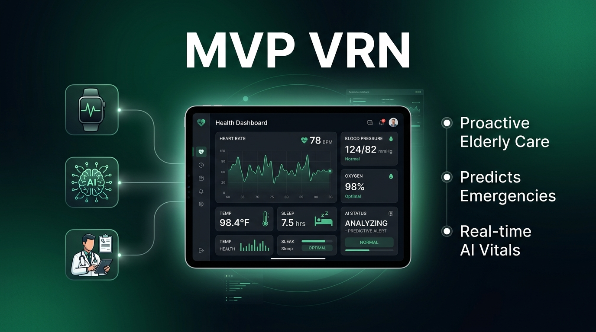
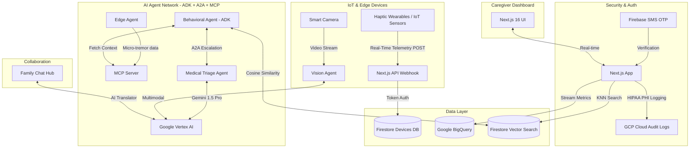

# 🌟 MVP VRN — Proactive Elderly Care, Powered by Agentic AI

> **Built for the Agentic AI Builder Series 2026 Finale**  
> A production-grade, real-time AI Agent dashboard monitoring elderly patients using IoT sensors, haptic wearables, multi-agent reasoning (ADK + A2A + MCP), and Google Vertex AI — deployed on Google Cloud Run.

[](https://github.com/rockerspace/AI-Agent-Series-Builder-Finale-2026/actions)
[](https://mvp-vrn-805096709254.us-central1.run.app)
[](https://nextjs.org)
[](https://cloud.google.com/vertex-ai)
[](https://firebase.google.com)
[](https://cloud.google.com/audit-logs)
[](./chrome-extension)

<p align="center">
  
</p>

---

## 🚀 Live Demo

### **[▶ Launch MVP VRN on Google Cloud Run](https://mvp-vrn-805096709254.us-central1.run.app)**

### **[🧩 Install Chrome Extension](./chrome-extension)** — Sidebar dashboard in any Chrome tab

---

## 🧩 Chrome Extension

MVP VRN ships with a **Chrome Side Panel Extension** that brings the full dashboard into any browser tab — no new windows, no switching apps.

### Install in 30 seconds
1. Open Chrome → go to **`chrome://extensions`**
2. Enable **Developer mode** (top-right toggle)
3. Click **"Load unpacked"**
4. Select the **`chrome-extension/`** folder from this repo
5. Click the MVP VRN icon in your Chrome toolbar → sidebar opens instantly!

### Extension Features

| Feature | Details |
|---|---|
| 👥 **Patients Tab** | Live IoT vitals (HR, SpO₂, Temp) with flash animations every 4 seconds |
| 🤖 **Agent Chat** | Full A2A routing simulation + 5 quick-send chips |
| 🏠 **Family Chat** | AI Translator (Gemini) + 5 quick-send chips + named family members |
| 🔔 **Push Notifications** | Simulated critical patient alerts as Chrome notifications |
| ⚡ **Alert Banner** | Rotates AI anomaly alerts automatically every 8 seconds |
| ↗ **Open Full App** | Direct link to the live Google Cloud Run deployment |

### Extension Structure
```
chrome-extension/
├── manifest.json     ← Manifest V3 config
├── background.js     ← Service worker + push notifications
├── sidepanel.html    ← Full dashboard UI (dark glassmorphic)
├── sidepanel.js      ← Live vitals + Agent/Family Chat logic
└── icons/
    ├── icon16.png
    ├── icon48.png
    └── icon128.png
```

---

## 📱 Progressive Web App (PWA)

With the removal of the heavy native iOS and Android apps, MVP VRN is now fully installable as a **Progressive Web App (PWA)** for on-the-go caregivers.

- **iOS Safari / Android Chrome:** Tap **"Add to Home Screen"** to install the dashboard directly to your phone.
- **Native Experience:** Runs in a standalone, full-screen mode (no URL bar) with a dark glassmorphic status bar.
- **Offline Caching:** Service workers ensure the app shell loads instantly even on poor hospital Wi-Fi networks.

---

## 📌 What Is MVP VRN?

MVP VRN is a **proactive, AI-driven caregiving platform** for elderly patients. Rather than reacting to emergencies, MVP VRN's multi-agent network monitors **subtle real-time deviations** in daily routines — mobility, sleep, vitals, sentiment — and alerts caregivers before a crisis occurs.

The platform is built around a fully decoupled **Agentic AI Architecture**:

| Protocol | Role |
|---|---|
| **ADK** (Agent Development Kit) | Agent scaffolding and lifecycle management |
| **MCP** (Model Context Protocol) | Secure real-time patient context fetching |
| **A2A** (Agent-to-Agent) | Multi-agent escalation and coordination |
| **Vertex AI — Gemini 1.5 Pro** | Clinical reasoning, multimodal analysis, NLP |

---

## ✨ Feature Highlights

### 🤖 Agent Chat — Live Multi-Agent Simulation

A fully interactive **Medical Triage Agent** chat powered by a simulated ADK + A2A network. The UI dynamically routes your prompt through a visible pipeline before returning a context-aware response.


| Chip | Agent Triggered | Simulated Response |
|---|---|---|
| 🩺 **Check vitals now** | Gemini 1.5 Pro + BigQuery | Cross-references live IoT ingestion streams |
| 📡 **Haptic sensor report** | Edge Agent + MCP | High-frequency micro-tremor gait analysis |
| 📷 **Camera feed** | Vision Agent (A2A) | Gemini multimodal room analysis |
| ⚠️ **Why did alert trigger?** | Gemini 1.5 Pro + Nano Banana | Qdrant vector similarity query + explanation |
| 💤 **Sleep analysis** | BigQuery + ADK | Sleep log vs 30-day baseline comparison |
| 🧠 **Run AI triage** | Medical Triage Agent | Full vitals + mobility triage with recommendation |

Each chip triggers a **visible 2-step A2A pipeline**: "Routing query..." → Full contextual AI response with action buttons.

---

### 🏠 Family Collaboration Hub — Smart AI Translator

A HIPAA-secure family group chat with **3 named family members** (Sarah/Daughter, Michael/Son, Priya/Niece) and an embedded Gemini AI translator that converts medical language into plain, reassuring language for the family.


| Message | AI Translation Topic | Family Reply Style |
|---|---|---|
| 💬 **How is Jane doing today?** | General health summary | Warm acknowledgement |
| 💊 **Any changes in her medication?** | Medication plan update | Pharmacy coordination |
| 🏡 **Can we visit her this weekend?** | Visit clearance | Weekend schedule coordination |
| 🍽️ **Was she eating properly?** | Appetite & nutrition tracking | Concerned follow-up |
| 😴 **Did she sleep well last night?** | AI sleep sensor data summary | Time awareness response |
| 🦾 **Is the mobility issue improving?** | Haptic gait analysis | Medical curiosity response |

Features: animated **typing indicator** (· · ·), animated **Framer Motion message bubbles**, and **context-aware replies** per topic.

---

### 📡 Patients — Live IoT Vitals Streaming

Every patient card shows **real-time simulated IoT telemetry** updating every 4 seconds:

| Metric | Source | Behavior |
|---|---|---|
| ❤️ Heart Rate (bpm) | Haptic wearable | Fluctuates ±2 bpm per cycle, pulses red on change |
| 🫧 SpO₂ (%) | Pulse oximeter sensor | Stays 80–100%, subtle fade animation |
| 🌡️ Temperature (°F) | Smart patch | Fluctuates ±0.2°F per cycle |
| 📋 Status badge | AI risk engine | Robert Smith randomly toggles Stable ↔ Review |

---

### 🔐 Security & Identity

- **Firebase SMS OTP** — Bulletproof phone verification with bulletproof reCAPTCHA reset (DOM-node-level replacement on retry)
- **HIPAA Audit Logging** — All PHI access logged to GCP Cloud Audit Logs
- **DID (Decentralized Identity)** — Enkrypt wallet integration (`did:ethr:...`)

---

### ☁️ Infrastructure

- **Google Cloud Run** — Fully serverless, auto-scaling containerized deployment
- **Multi-stage Docker Build** — `deps → builder → runner` pattern for minimal image size
- **GitHub Actions CI** — Lint + TypeScript type-check on every push to `main`
- **Google Cloud Build** — Auto-deploys on push with optional `.env.local` injection
- **Zod Environment Validation** — Graceful defaults prevent CI/CD crashes

---

## 🏗️ Architecture



---

## 🛠️ Tech Stack

| Layer | Technology |
|---|---|
| **Frontend** | Next.js 16.3 (Turbopack), React, Tailwind CSS, Framer Motion |
| **Auth** | Google Identity Platform — Firebase Auth (SMS OTP + invisible reCAPTCHA) |
| **AI Engine** | Google Vertex AI (Gemini 1.5 Pro) |
| **Agent Framework** | ADK (Agent Development Kit), MCP, A2A Protocols |
| **Data Warehouse** | Google BigQuery |
| **Vector Search** | Firestore Vector Search (KNN / COSINE similarity) |
| **IoT Ingestion** | Next.js API Webhook + Firestore Device Registry |
| **Infrastructure** | Google Cloud Run (Serverless Docker) |
| **CI/CD** | GitHub Actions + Google Cloud Build |
| **Identity (Web3)** | Enkrypt DID (`did:ethr:...`) |
| **Validation** | Zod (type-safe environment schema) |

---

## 🚀 Local Development

### Prerequisites
- Node.js 20+
- Firebase project with **Phone Auth** enabled
- Google Cloud project with **Vertex AI, BigQuery, Firestore** APIs enabled

### Setup

```bash
git clone https://github.com/rockerspace/AI-Agent-Series-Builder-Finale-2026.git
cd AI-Agent-Series-Builder-Finale-2026
npm install
```

Create a `.env.local` file in the project root:

```env
# Firebase (Client-side)
NEXT_PUBLIC_FIREBASE_API_KEY="your-api-key"
NEXT_PUBLIC_FIREBASE_AUTH_DOMAIN="your-project.firebaseapp.com"
NEXT_PUBLIC_FIREBASE_PROJECT_ID="your-project-id"
NEXT_PUBLIC_FIREBASE_STORAGE_BUCKET="your-project.appspot.com"
NEXT_PUBLIC_FIREBASE_MESSAGING_SENDER_ID="your-sender-id"
NEXT_PUBLIC_FIREBASE_APP_ID="your-app-id"

# Google Cloud (Server-side)
GCP_PROJECT_ID="your-gcp-project-id"
GCP_REGION="us-central1"
```

```bash
# Visit the live application deployed on Google Cloud Run
# https://mvp-vrn-805096709254.us-central1.run.app

# Alternatively, to run the development server locally:
npm run dev
# Then open http://localhost:3000
```

---

## ☁️ Google Cloud Run Deployment

```bash
# One-command deploy from source
gcloud run deploy mvpvrn-app \
  --source . \
  --region us-central1 \
  --platform managed \
  --allow-unauthenticated \
  --set-env-vars "GCP_PROJECT_ID=your-project-id,GCP_REGION=us-central1"
```

> **Note:** The `Dockerfile` uses a safe optional `cp` pattern for `.env.local` — automated Cloud Build triggers won't fail if the file is absent.

---

## 📁 Project Structure

```
mvpvrn-app/
├── src/
│   ├── app/
│   │   ├── page.tsx              # Main dashboard: all tabs, IoT simulation, Agent & Family Chat
│   │   ├── layout.tsx            # Root layout: meta tags, fonts
│   │   ├── actions.ts            # Server actions: BigQuery, Vertex AI triage, telemetry
│   │   └── api/
│   │       └── telemetry/ingest/ # IoT webhook endpoint (device auth + BigQuery stream)
│   ├── lib/
│   │   ├── env.ts                # Zod-validated env schema with safe defaults
│   │   └── gcp/
│   │       ├── firebase.ts           # Firebase Auth client
│   │       ├── firestore-admin.ts    # Admin SDK (server-side Firestore)
│   │       └── vector-search.ts      # Firestore KNN vector similarity search
│   └── agents/
│       └── gemini-multi-agent.ts     # Vertex AI multi-agent orchestration
├── docs/
│   ├── PRD.md                    # Product Requirements Document
│   ├── ARCHITECTURE.md           # Architecture deep-dive
│   └── AGENTS.md                 # Agent protocols (A2A / MCP / ADK spec)
├── .github/workflows/
│   └── ci.yml                    # GitHub Actions CI (lint + TypeScript)
├── Dockerfile                    # Multi-stage production Docker build
├── .gcloudignore                 # Ensures .env.local uploads in Cloud Build
└── cloudbuild.yaml               # Google Cloud Build trigger config
```

---

## 📄 Documentation

- [Product Requirements Document](./docs/PRD.md)
- [Architecture Overview](./docs/ARCHITECTURE.md)
- [Agent Protocols (A2A / MCP / ADK)](./docs/AGENTS.md)

---

 About This Project

MVP VRN was built end-to-end demonstrating how a coordinated network of specialized AI agents — connected via **A2A protocols**, grounded by **MCP-served context**, and powered by **Vertex AI (Gemini 1.5 Pro)** — can transform reactive healthcare into **proactive, personalized, always-on caregiving** at scale.

The platform also demonstrates **scalability through Haptic Wearable sensors**: high-frequency micro-tremor and gait data is processed at the edge before being escalated to the cloud agent network, enabling fall-risk detection and behavioral anomaly identification without requiring constant camera monitoring.

---

*Built with ❤️ using Google Cloud · Vertex AI · Firebase · Next.js · ADK · MCP · A2A*


