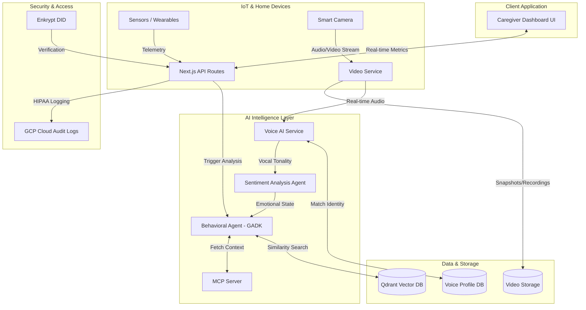

# AuraCare - Proactive Elderly Caregiver Support

AuraCare is an AI-driven monitoring system that uses ambient IoT sensors to detect subtle deviations in daily routines (mobility, sleep, heart rate) and alerts caregivers before emergencies occur.

- **Decentralized Caregiver Identity**: Integrated with Enkrypt for immutable identity checks.
- **HIPAA Audit Log Middleware**: Tracks and logs all sensitive data access.
- **Instant PDF Exports**: Click the Export Report button to instantly generate a PDF readout of the patient's current metrics for medical filing.
- **AI Agent Chat**: An interactive chat interface for caregivers to converse with the Medical Triage Agent (Gemini 1.5 Pro concept) regarding patient status and historical data.
- **Room View (Video Analysis)**: Simulates Gemini 1.5 Pro's video understanding capabilities with real-time bounding boxes and multimodal environment logs for fall risk detection.
- **Google Cloud Run Ready**: Containerized via Docker and configured for `cloudbuild.yaml` CI/CD to ensure enterprise-grade backend scalability.
- **Vertex AI & AI Studio (Gemini 1.5 Pro)**: Integrated with the `@google-cloud/vertexai` SDK for true multimodal video/audio analysis.
- **Gemma 2B Edge Intelligence**: Local behavioral anomaly detection on the home IoT gateway for offline, privacy-preserving monitoring.
- **Agent Architecture (ADK, MCP, A2A)**: Utilizes the Agent Development Kit and Model Context Protocol to seamlessly hand off context between the local edge agent and the cloud AI.
- **BigQuery Analytics**: Streams historical sensor telemetry for predictive modeling.
- **LLM Observability**: OpenTelemetry tracing for prompt hashing and token tracking, coupled with an Explainability Engine for deterministic alert justifications.
- **GCP Cloud Audit Logging**: Implements HIPAA-compliant data access logging through Google Cloud Logging APIs.

## Documentation
*   [Product Requirements Document (PRD)](./PRD.md)
*   [Architecture Overview](./ARCHITECTURE.md)

## Architecture Diagram



## Tech Stack
*   **Frontend & API:** Next.js, React, Tailwind CSS
*   **AI Agents & Orchestration:** Google Agent Development Kit (GADK) & Mastra
*   **Context Management:** Model Context Protocol (MCP)
*   **Vector Database:** Qdrant
*   **Authentication & Security:** Enkrypt (HIPAA Compliant Logging)
*   **Infrastructure:** GCP Cloud Run

## Getting Started (Frontend Dashboard)

First, run the development server:

```bash
npm run dev
# or
yarn dev
# or
pnpm dev
# or
bun dev
```

Open [http://localhost:3000](http://localhost:3000) with your browser to see the caregiver dashboard.

## Testing Google Cloud Backend Locally (Vertex AI)

If you wish to test the Vertex AI (Gemini 1.5 Pro) integration directly on your local machine using the official `@google-cloud/vertexai` SDK:

1. Install the Google Cloud CLI (`gcloud`) if you haven't already.
2. Authenticate your local machine:
   ```bash
   gcloud auth application-default login
   ```
3. Set your project ID to your GCP project (e.g., `vemarai`):
   ```bash
   gcloud config set project vemarai
   ```
4. Install the Vertex AI SDK (do not push this to Vercel to avoid build size limits):
   ```bash
   npm install @google-cloud/vertexai
   ```
5. Run the provided test script:
   ```bash
   npx ts-node test-vertex.ts
   ```

## Learn More

To learn more about Next.js, take a look at the following resources:

- [Next.js Documentation](https://nextjs.org/docs) - learn about Next.js features and API.
- [Learn Next.js](https://nextjs.org/learn) - an interactive Next.js tutorial.

You can check out [the Next.js GitHub repository](https://github.com/vercel/next.js)

## 🚀 Deployment (Vercel)

AuraCare is optimized for Vercel, ensuring zero-config deployments for your frontend.

### Sharing Your Live Link
After importing this repository into your Vercel account and deploying:
1. Go to your **Vercel Dashboard**.
2. Click on the **AuraCare** project.
3. Look for the **Domains** section (e.g., `ai-agent-series-builder-finale-2026.vercel.app`).
4. Click on that link to visit your live site! 
5. You can share this exact URL with family members, and beta testers. The dynamic "real-time" dashboard will run perfectly on their mobile phones and laptops!

This is a [Next.js](https://nextjs.org) project bootstrapped with [`create-next-app`](https://nextjs.org/docs/app/api-reference/cli/create-next-app).

## Live Deployment 🚀
The application is currently deployed and running on Google Cloud Run with continuous deployment from this repository:
**[AuraCare Live Service](https://ai-agent-series-builder-finale-2026-805096709254.us-central1.run.app)**

Check out our [Next.js deployment documentation](https://nextjs.org/docs/app/building-your-application/deploying) for more details.
