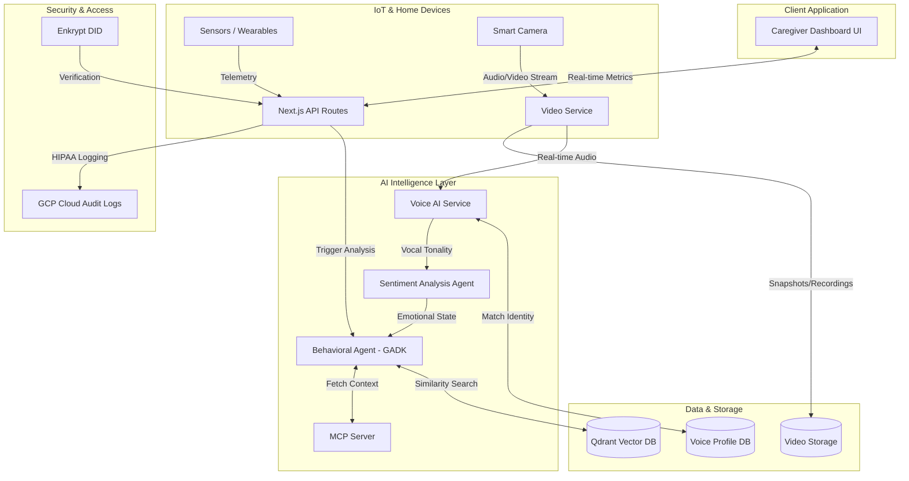

# AuraCare - Proactive Elderly Caregiver Support

AuraCare is an AI-driven monitoring system that uses ambient IoT sensors to detect subtle deviations in daily routines (mobility, sleep, heart rate) and alerts caregivers before emergencies occur.

## Documentation
*   [Product Requirements Document (PRD)](./PRD.md)
*   [Architecture Overview](./ARCHITECTURE.md)

## Architecture Diagram



## Tech Stack
*   **Frontend & API:** Next.js, React, Tailwind CSS
*   **AI Agents & Orchestration:** Google Agent Development Kit (GADK) & Mastra
*   **Context Management:** Model Context Protocol (MCP)
*   **Vector Database:** Qdrant
*   **Authentication & Security:** Enkrypt (HIPAA Compliant Logging)
*   **Infrastructure:** GCP Cloud Run

## Getting Started

First, run the development server:

```bash
npm run dev
# or
yarn dev
# or
pnpm dev
# or
bun dev
```

Open [http://localhost:3000](http://localhost:3000) with your browser to see the caregiver dashboard.

## Learn More

To learn more about Next.js, take a look at the following resources:

- [Next.js Documentation](https://nextjs.org/docs) - learn about Next.js features and API.
- [Learn Next.js](https://nextjs.org/learn) - an interactive Next.js tutorial.

You can check out [the Next.js GitHub repository](https://github.com/vercel/next.js) - your feedback and contributions are welcome!

## Deploy on Vercel

The easiest way to deploy your Next.js app is to use the [Vercel Platform](https://vercel.com/new?utm_medium=default-template&filter=next.js&utm_source=create-next-app&utm_campaign=create-next-app-readme) from the creators of Next.js.

Check out our [Next.js deployment documentation](https://nextjs.org/docs/app/building-your-application/deploying) for more details.
