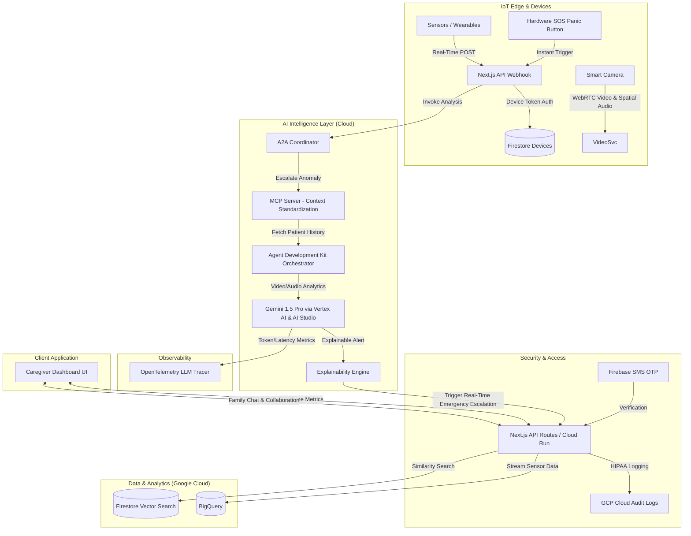

# Architecture - MVP VRN

MVP VRN leverages a modern, serverless Google Tech Stack combined with AI Agent frameworks to provide proactive caregiver support.

## High-Level Architecture Diagram
*(Mermaid Diagram)*

1.  **Next.js API Webhook (Edge Ingestion):** `/api/telemetry/ingest` handles thousands of IoT pings concurrently, validates secure device tokens against Firestore, and proxies data to downstream cloud tools.
2.  **WebRTC & Spatial Audio Ingestion:** Secure, low-latency WebRTC pipelines stream live video and spatial audio from IoT cameras directly into the edge and cloud processing layers for immediate context.
3.  **ADK, MCP, and A2A Protocols:** 
    - The **Agent-to-Agent (A2A)** protocol manages the handoff between the webhook events and the cloud-based Gemini agents.
    - The **Model Context Protocol (MCP)** securely formats and standardizes patient history before sending it to the cloud.
    - The **Agent Development Kit (ADK)** and **Antigravity** toolchains orchestrate these workflows.
4.  **Vertex AI & Google AI Studio (Gemini 1.5 Pro):** Replaces generic ML pipelines. Handles complex multimodal reasoning (analyzing WebRTC video feeds and spatial audio sentiment) when escalated by the edge agent. Includes dedicated **Voice AI** and **Sentiment Analysis** modules.
5.  **Real-Time Emergency Escalation & SOS Button:** If severe distress (e.g., a fall) is detected, or the **SOS Panic Button** is pressed, the A2A Coordinator bypasses standard polling and triggers an instant emergency escalation via Cloud Run, notifying caregivers and the **Family Chat** thread immediately.
4.  **BigQuery (Analytics):** Ingests all historical IoT telemetry and alert data for long-term trend analysis and dashboard querying.
5.  **OpenTelemetry (LLM Observability):** Traces all LLM calls to Gemini and Gemma, logging token usage, prompt hashes, and latency metrics for safety-critical monitoring.
6.  **Explainability Engine:** Sits between the AI reasoning and the user dashboard, translating probabilistic LLM outputs into deterministic, natural-language justifications for why an emergency alert was triggered.
7.  **Infrastructure (GCP Cloud Run):** Containerized deployment ensuring rapid scalability and HIPAA-eligible serverless execution for the API and agent orchestrators.
